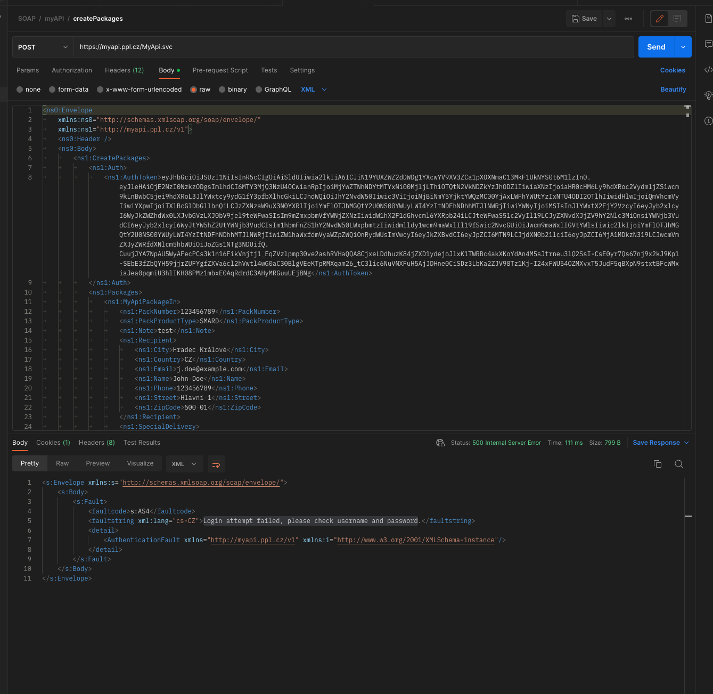

# Problém s odesláním SOAP zprávy `CreatePackages` z Python skriptu
Odeslání dat na metodu `CreatePackages` z Python skriptu vrací chybu 500. V případě, že se data odesílají z Postmanu, tak vše proběhne v pořádku (odpověď serveru je 200 a v těle odpovědi se vrátí např alespoň: `Login attempt failed, please check username and password` nebo `Package number does not belong to CustomerID or SubjectID. Contact sales representative or customer IT support.` což je pro ilustrování problému v pořádku).
Metoda Login a IsHelathy fungují v pořádku (jak v Postman, tak i Python skriptu s použitím knihovny [`requests`](https://requests.readthedocs.io/en/latest/)).

Odesílají se stejná data, která jsou v přiložena v souboru [`example.xml`](example.xml) (ten samozřejmě není validní už kvůli přiřazenému sledovacímu číslu) a stejné hlavičky:
```http
Content-Type: text/xml; charset=utf-8
SOAPAction: http://myapi.ppl.cz/v1/IMyApi2/CreatePackages
Host: myapi.ppl.cz
Content-Length: ...
```

## Příklad odeslání z Postmanu


## Příklad odeslání z Python skriptu
(pouze pro ilustraci - hlavičky, data a URL)
```python
import requests

response = requests.post(
    'https://myapi.ppl.cz/MyApi.svc',
    data="""<?xml version="1.0" encoding="utf-8"?>      
<ns0:Envelope
	xmlns:ns0="http://schemas.xmlsoap.org/soap/envelope/"
	xmlns:ns1="http://myapi.ppl.cz/v1">
	<ns0:Header />
	<ns0:Body>
		<ns1:CreatePackages>
			<ns1:Auth>
				<ns1:AuthToken>eyJhbGciOiJSUzI1NiIsInR5cCIgOiAiSldUIiwia2lkIiA6ICJiN19YUXZWZ2dDWDg1YXcwYV9XV3ZCa1pXOXNmaC13MkF1UkNYS0t6M1lzIn0.eyJleHAiOjE2NzI0MTQ2NDIsImlhdCI6MTY3MjQxMjg0MiwianRpIjoiYWQ1NmMwNTktNmMwZC00OWIzLTg3MmYtOGMzM2IwNGIwMDEyIiwiaXNzIjoiaHR0cHM6Ly9hdXRoc2VydmljZS1wcm9kLnBwbC5jei9hdXRoL3JlYWxtcy9ydG1fY3pfbXlhcGkiLCJhdWQiOiJhY2NvdW50Iiwic3ViIjoiNjBiNmY5YjktYWQzMC00YjAxLWFhYWUtYzIxNTU4ODI2OTlhIiwidHlwIjoiQmVhcmVyIiwiYXpwIjoiTXlBcGlDbGllbnQiLCJzZXNzaW9uX3N0YXRlIjoiMTE4MTZlNDMtNTljMC00NTU5LWI3NjMtNTc0YmY4YjZhY2ZjIiwiYWNyIjoiMSIsInJlYWxtX2FjY2VzcyI6eyJyb2xlcyI6WyJkZWZhdWx0LXJvbGVzLXJ0bV9jel9teWFwaSIsIm9mZmxpbmVfYWNjZXNzIiwidW1hX2F1dGhvcml6YXRpb24iLCJteWFwaS51c2VyIl19LCJyZXNvdXJjZV9hY2Nlc3MiOnsiYWNjb3VudCI6eyJyb2xlcyI6WyJtYW5hZ2UtYWNjb3VudCIsIm1hbmFnZS1hY2NvdW50LWxpbmtzIiwidmlldy1wcm9maWxlIl19fSwic2NvcGUiOiJwcm9maWxlIGVtYWlsIiwic2lkIjoiMTE4MTZlNDMtNTljMC00NTU5LWI3NjMtNTc0YmY4YjZhY2ZjIiwiZW1haWxfdmVyaWZpZWQiOnRydWUsImVwcyI6eyJkZXBvdCI6eyJpZCI6MTN9LCJjdXN0b21lciI6eyJpZCI6MjA1MDkzN319LCJwcmVmZXJyZWRfdXNlcm5hbWUiOiJoZGs1NTg3NDUifQ.g18AfXGDExgU0E6IdEsQ5jWnW9cxo6tCGiSjy3xR8cffxNITfuD9sqeuPXrkpqZJyC6b-Lqi4cPmOsZp5GYqqauoB6iHs7L1qH1OCCqb3bB4G7DAghwADO2LHXQ7Sn9RJytLNIeNH71fTuHAKRLVAq_DacRJcdEATplpF-Xgc3IYDiaaC6W4NK4mnvK3cO5S5gZf3yEIx191G6CPzH6I-yZ8hgeI-YzJ3DNH03WL5pGCHG544B8k3tp5B-4m5kFMEgO7rsr08tZqYNGxOb8CUPgHlUl7mfcCO_RcDivTaItFv8cblKNkSnroofFm_hfKhoFfBzahTZXLMLYjmTNh7g</ns1:AuthToken>
			</ns1:Auth>
			<ns1:Packages>
				<ns1:MyApiPackageIn>
					<ns1:PackNumber>123456789</ns1:PackNumber>
					<ns1:PackProductType>SMARD</ns1:PackProductType>
					<ns1:Note>test</ns1:Note>
					<ns1:Recipient>
						<ns1:City>Hradec Králové</ns1:City>
						<ns1:Country>CZ</ns1:Country>
						<ns1:Email>j.doe@example.com</ns1:Email>
						<ns1:Name>John Doe</ns1:Name>
						<ns1:Phone>123456789</ns1:Phone>
						<ns1:Street>Hlavní 1</ns1:Street>
						<ns1:ZipCode>500 01</ns1:ZipCode>
					</ns1:Recipient>
					<ns1:SpecialDelivery>
						<ns1:ParcelShopCode>123456789</ns1:ParcelShopCode>
					</ns1:SpecialDelivery>
					<ns1:PaymentInfo>
						<ns1:BankAccount>123456789</ns1:BankAccount>
						<ns1:BankCode>0300</ns1:BankCode>
						<ns1:CodCurrency>CZK</ns1:CodCurrency>
						<ns1:CodPrice>100</ns1:CodPrice>
						<ns1:CodVarSym>123456789</ns1:CodVarSym>
						<ns1:InsurCurrency>CZK</ns1:InsurCurrency>
						<ns1:InsurPrice>100</ns1:InsurPrice>
						<ns1:SpecSymbol>123456789</ns1:SpecSymbol>
					</ns1:PaymentInfo>
					<ns1:PackagesExtNums>
						<ns1:MyApiPackageExtNum>
							<ns1:Code>B2CO</ns1:Code>
							<ns1:ExtNumber>123456789</ns1:ExtNumber>
						</ns1:MyApiPackageExtNum>
						<ns1:MyApiPackageExtNum>
							<ns1:Code>CUST</ns1:Code>
							<ns1:ExtNumber>123456789</ns1:ExtNumber>
						</ns1:MyApiPackageExtNum>
					</ns1:PackagesExtNums>
					<ns1:PackageServices>
						<ns1:MyApiPackageInServices>
							<ns1:SvcCode>COD</ns1:SvcCode>
						</ns1:MyApiPackageInServices>
					</ns1:PackageServices>
					<ns1:PackageFlags>
						<ns1:MyApiFlag>
							<ns1:Code>CL</ns1:Code>
							<ns1:Value>true</ns1:Value>
						</ns1:MyApiFlag>
					</ns1:PackageFlags>
					<ns1:PackageSet>
						<ns1:MastepackNumber>123456789</ns1:MastepackNumber>
						<ns1:PackageInSetNr>1</ns1:PackageInSetNr>
						<ns1:PackagesInSet>1</ns1:PackagesInSet>
					</ns1:PackageSet>
					<ns1:WeightedPackageInfo>
						<ns1:Weight>10.22</ns1:Weight>
					</ns1:WeightedPackageInfo>
				</ns1:MyApiPackageIn>
			</ns1:Packages>
		</ns1:CreatePackages>
	</ns0:Body>
</ns0:Envelope>""",
    headers={'Content-Type': 'text/xml; charset=utf-8', 'SOAPAction': 'http://myapi.ppl.cz/v1/IMyApi2/CreatePackages'},
    timeout=10,
)


print(response.text)
print(response.request.headers)
```

A [odpověď](python_requests-response.xml) je:

```xml
<s:Envelope xmlns:s="http://schemas.xmlsoap.org/soap/envelope/">
    <s:Body>
        <s:Fault>
            <faultcode xmlns:a="http://schemas.microsoft.com/net/2005/12/windowscommunicationfoundation/dispatcher">
                a:InternalServiceFault</faultcode>
            <faultstring xml:lang="en-US">The server was unable to process the request due to an internal error. For
                more information about the error, either turn on IncludeExceptionDetailInFaults (either from
                ServiceBehaviorAttribute or from the &lt;serviceDebug&gt; configuration behavior) on the server in order
                to send the exception information back to the client, or turn on tracing as per the Microsoft .NET
                Framework SDK documentation and inspect the server trace logs.</faultstring>
        </s:Fault>
    </s:Body>
</s:Envelope>
```
